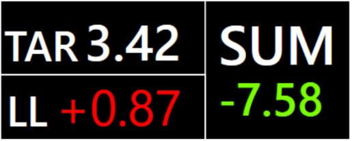

# Tier 6: Stint planning

For endurance racing, particularily the very long races, there is little strategy with regards to going long or short on stints. It is all about getting the most laps out of a full tank of fuel. Teams often practice before the races, finding a fuel/lap value that suits their race plan. The fuel consumption will boil down to a specific number of laps per stint, a specific stint duration and in summation a specific number of stints in the race, evenly divided by the drivers and perhaps with some fuel headroom on the last stint to go a bit faster.

The plugin menu allows you to set a fuel/lap target manually before the race starts. You can keep track of your fuel usage in the Fuel Target Delta Screen, which shows the target, the gap to target on last lap and the gap to target so far on the stint.

The sum will reset on pit stop, but can also be reset by using PitMenu1 + "OK".

You don't have to be an endurance racer to make use of this. If you've found out that you use 1.50 liters per lap, and therefore have planned with 30 liters of fuel for a 20 lap race - you can set your fuel target to 1.50 and use the delta screen to make sure you're staying within limits.&#x20;
